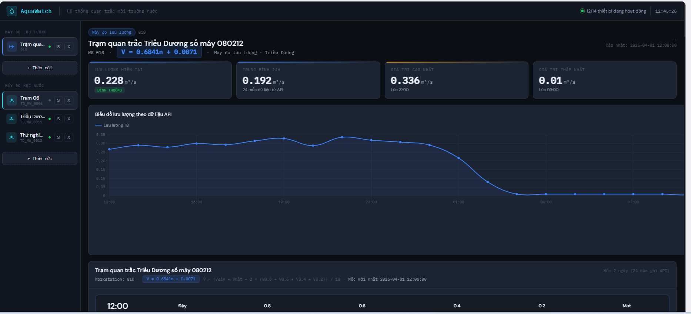

# Hydro Logger 2

ESP32-based water level monitoring system with dual connectivity (4G SIM + Wi-Fi DCOM), OTA firmware updates, and configurable sensor support.


## Dashboard

This dashboard is used to collect data from this device.



## Features

- **Dual sensor support** - Laser or Ultrasonic sensor, selected at compile time
- **Dual connectivity** - SIM 4G (AT commands over UART) and Wi-Fi DCOM with automatic failover
- **OTA updates** - Over-the-air firmware updates via `esp_https_ota` with rollback support
- **Scheduled operation** - Measures every 10 minutes, syncs to server every hour (single connectivity session)
- **Retry with timeout** - Time sync and OTA version check retry on failure (20s window, 2s interval)
- **Boot diagnostics** - Self-test of all modules (RTC, ADC, sensors, connectivity) at power-on
- **Power management** - Safe mode disables peripherals between scheduled windows
- **Persistent preferences** - Last successful connectivity module saved to NVS

## Architecture

```text
+-------------------------------------------------------------+
|                        Application                          |
|  Scheduler | Measure | Sync (+ OTA) | Notify | Diagnostic   |
+-------------------------------------------------------------+
|                        Middleware                           |
|              MessageBus  |  PublishApi (queues)             |
+-------------------------------------------------------------+
|                         Services                            |
|  ConnectivityManager | HttpClient | JsonPacker | OtaService |
|  ServerApi | LogService | PowerManager                     |
+-------------------------------------------------------------+
|                         Modules                             |
|  SensorManager (Laser/Ultrasonic) | RTC PCF8563 | IO Ctrl  |
+-------------------------------------------------------------+
|                      Board Drivers                          |
|           GPIO  |  UART  |  I2C  |  ADC                    |
+-------------------------------------------------------------+
|                     ESP-IDF / FreeRTOS                      |
+-------------------------------------------------------------+
```

## Task Flow

```text
Boot
 |-> Diagnostic Task (test RTC, ADC, Sensor, SIM, DCOM)
 |-> Delay 10s
 |-> Delete diagnostic task
 |
 |-> Scheduler Task (priority 7) -- reads RTC every 200ms
 |     |
 |     |-- Every 10 min (00,10,20,30,40,50)
 |     |     |-> Measure Task (priority 6)
 |     |           |-> Warmup sensor -> Read 3 samples -> Publish to queue
 |     |
 |     |-- Every 60 min (minute == 0)
 |     |     |-> Sync Task (priority 5) -- single connectivity session
 |     |           |-> Warmup connectivity (SIM/DCOM failover) -- single powerOn
 |     |           |-> Time sync (20s retry window, 2s interval on fail)
 |     |           |-> Send queued measurements + logs (1-min window)
 |     |           |-> OTA version check (20s retry, DCOM only)
 |     |           |-> Power off module -- single powerOff
 |     |
 |     |-- Outside schedule -> Safe mode (peripherals off)
 |
 |-> Notify Task (priority 3) -- LED 1s blink / Speaker urgent 0.5s
```

## Pin Mapping

| Function | GPIO | Direction | Notes |
|----------|------|-----------|-------|
| Laser Power | GPIO26 | Output | Active HIGH |
| Ultrasonic Power | GPIO32 | Output | Active HIGH |
| SIM 4G Power | GPIO27 | Output | Edge-triggered |
| DCOM Power | GPIO23 | Output | Active HIGH |
| LED | GPIO25 | Output | Status indicator |
| Wakeup (RTC INT) | GPIO33 | Input | PCF8563 alarm |
| Voltage ADC | GPIO39 | Input | ADC1_CH3 (SENSOR_VN) |
| SIM UART TX | GPIO5 | Output | UART2 |
| SIM UART RX | GPIO18 | Input | UART2, 115200 baud |
| Sensor UART TX | GPIO17 | Output | UART1 |
| Sensor UART RX | GPIO16 | Input | UART1, 19200/115200 baud |
| I2C SCL | GPIO22 | Open-drain | RTC PCF8563 |
| I2C SDA | GPIO21 | Open-drain | RTC PCF8563 (addr 0x51) |

## Partition Table

| Partition | Type | Size | Purpose |
|-----------|------|------|---------|
| nvs | data | 16 KB | Non-volatile storage |
| otadata | data | 8 KB | OTA boot state |
| phy_init | data | 4 KB | PHY calibration |
| ota_0 | app | 1600 KB | Active firmware |
| ota_1 | app | 1600 KB | OTA update slot |
| storage | data | 800 KB | SPIFFS storage |

## Build & Flash

### Prerequisites

- [ESP-IDF v5.5.3](https://docs.espressif.com/projects/esp-idf/en/v5.5.3/esp32/get-started/)
- ESP32-D0WD-V3 board

### Build

```bash
idf.py build
```

### Flash & Monitor

```bash
idf.py -p COM3 flash monitor
```

### Build Options

Select sensor at compile time:

```bash
# Laser sensor (default)
idf.py build

# Ultrasonic sensor
idf.py build -DCMAKE_CXX_FLAGS="-DPINS_UART1_DEVICE=2"
```

OTA build profiles:

```bash
# Test OTA endpoint
idf.py build -DCMAKE_CXX_FLAGS="-DTEST_OTA"

# Production (default)
idf.py build
```

## Configuration

Key parameters in [`main/common/config.hpp`](main/common/config.hpp):

| Parameter | Default | Description |
|-----------|---------|-------------|
| `kDiagnosticDelayMs` | 10000 | Delay after boot diagnostic |
| `kDistanceSamples` | 3 | Readings per measurement |
| `kMaxRepeatRead` | 5 | Max retries per sample |
| `kConnCheckTimeoutMs` | 60000 | Connectivity check timeout |
| `kSyncWindowMs` | 60000 | Data send window duration |
| `kFetchTimeoutMs` | 20000 | Time sync / OTA fetch retry window |
| `kFetchRetryDelayMs` | 2000 | Delay between fetch retries |
| `kOtaMaxAttempts` | 3 | Max OTA download retries |
| `kCurrentFwVersion` | "1.1.0" | Current firmware version |

## Project Structure

```text
main/
|-- app/                    # FreeRTOS tasks & orchestration
|   |-- app_main.cpp        # Entry point, boot sequence
|   |-- scheduler_task.cpp  # Time-based task scheduler
|   |-- measure_task.cpp    # Sensor reading & data publish
|   |-- sync_task.cpp       # Server sync + time sync + OTA check (single session)
|   |-- notify_task.cpp     # LED & speaker control
|   |-- ota_task.cpp        # Stub (OTA merged into sync_task)
|   `-- diagnostic_task.cpp # Boot-time self-test
|-- middleware/             # Message queues & pub/sub
|-- services/
|   |-- connectivity/       # SIM 4G + DCOM Wi-Fi manager
|   |-- net/                # HTTP client & server API
|   |-- pack/               # JSON serialization
|   |-- logging/            # Session log buffer
|   |-- power/              # Safe mode power management
|   `-- ota/                # OTA update service
|-- modules/
|   |-- sensor/             # Laser & ultrasonic drivers
|   |-- rtc/                # PCF8563 RTC driver
|   `-- io/                 # GPIO power control
|-- board/                  # Low-level drivers (GPIO, UART, I2C, ADC)
|-- common/                 # Config, NVS store, time utilities
`-- docs/                   # Design documents
```

## License

This project is licensed under the MIT License - see the [LICENSE](LICENSE) file for details.
